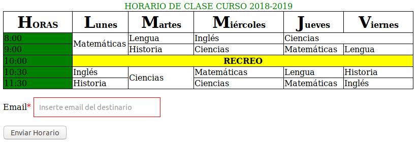

# 02. Ejercicio pseudo-selectores CSS

Aplica los estilos correspondientes para obtener el siguiente resultado:



Es necesario realizar los siguientes acciones:
1. Crea el fichero `index.html` y copia el contenido de esta página.
2. Crea y enlaza el fichero `css\style.css`.
3. Configura las reglas CSS para obtener el resultado de la imagen.


**Reglas a aplicar:**

1. Tabla border colapsado y un borde 1px, solido y color negro.
2. Utilizando únicamente pseudoselectores da color de fondo verde a las casillas que contienen horas.
3. Utilizando únicamente pseudoselectores da color de fondo amarillo a la celda de recreo.
4. Cambiar los estado de los enlaces para que:
   1. Nunca estén subrayados
   2. Si están visitados se muestren en rojo
   3. Si no están visitado se muestren en verde
5. Utilizando pseudoselectores hacer que cuando pasemos el ratón sobre la columna del viernes aumente el tamaño de letra al doble.
6. Utilizando Pseudoelementos Haz que la primera letra de los días tenga el doble de tamaño.
7. Añade un borde rojo que esté separado 5 px a los campos obligatorios.
8. Añade un * en rojo detrás de las etiquetas.


<br><br>

RECURSOS A UTILIZAR.

* HTML 
  
```html
<!DOCTYPE html>
<html lang="es">

<head>
    <meta charset="UTF-8">
    <meta name="viewport" content="width=device-width, initial-scale=1.0">
    <meta http-equiv="X-UA-Compatible" content="ie=edge">
    <title>Ejercicios con Pseudoselectores</title>

    <link href="css/estilos.css" type="text/css" rel="stylesheet" />
</head>

<body>
    <table>
        <caption><a href="#" target="_blank">HORARIO DE CLASE CURSO 2018-2019</a></caption>
        <thead>
            <tr>
                <th>HORAS</th>
                <th>Lunes</th>
                <th>Martes</th>
                <th>Miércoles</th>
                <th>Jueves</th>
                <th>Viernes</th>
            </tr>
        </thead>
        <tbody>
            <tr>
                <td>8:00</td>
                <td rowspan="2">Matemáticas</td>
                <td>Lengua</td>
                <td>Inglés</td>
                <td colspan="2">Ciencias</td>
            </tr>
            <tr>
                <td>9:00</td>
                <td>Historia</td>
                <td>Ciencias</td>
                <td>Matemáticas</td>
                <td>Lengua</td>
            </tr>
            <tr>
                <td>10:00</td>
                <th colspan="5">RECREO</th>
            </tr>
            <tr>
                <td>10:30</td>
                <td>Inglés</td>
                <td rowspan="2">Ciencias</td>
                <td>Matemáticas</td>
                <td>Lengua</td>
                <td>Historia</td>
            </tr>
            <tr>
                <td>11:30</td>
                <td>Historia</td>
                <td>Ciencias</td>
                <td>Matemáticas</td>
                <td>Inglés</td>
            </tr>
        </tbody>
    </table>

    <form>
        <p>
            <label for="destino">Email</label>
            <input type="email" name="destino" placeholder="Inserte email del destinario" required />
        </p>
        <input type="button" value="Enviar Horario" />
    </form>
</body>

</html>
```

* CSS

y crea un archivo CSS llamado `styles.css` dentro de la carpeta CSS. Puedes copiar el código a continuación para que resulte más fácil su realización.

```css
/* Tabla border colapsado y un borde 1px, solido y color negro.
*/

/* Utilizando únicamente pseudoselectores da color de fondo verde a las casillas que contienen horas */


/* Utilizando únicamente pseudoselectores da color de fondo amarillo a la celda de recreo */


/* Cambiar los estado de los enlaces para que:

 Nunca estén subrayados
 Si están visitados se muestren en rojo
 Si no están visitado se muestren en verde */


/* Utilizando pseudoselectores hacer que cuando pasemos el ratón sobre la columna del viernes
aumente el tamaño de letra al doble */


/* Utilizando Pseudoelementos Haz que la primera letra de los días tenga el doble de tamaño*/

/* Añade un borde rojo que esté separado 5 px a los campos obligatorios */


/* Añade un * en rojo detrás de las etiquetas */


```