# Maquetación y Diseño Responsivo:<br>CSS-Grid y FlexBox

## 0. Un poco de Historia

Al principio la maquetación se realizaba con Tablas `table`, puesto que normalmente una Web cumple con un formato *tabular*.

De ahí se pasó a usar `floats`. La ventaja de los floats es que nuestro diseño no estaba plagado de etiquetas *td* y *tr* y se separaba el contenido del diseño, maquetando con CSS.<br>
Pero los floats tenían un gran problema, nunca se diseñaron para la labor de *maquetación*. Su comentido era alinear imágenes y texto. Nada más. Por lo que se debían usar `hacks` (trucos CSS) para conseguir maquetar la web.

Debido a que la maquetación se convirtió en algo muy complejo, surgieron muchos frameworks CSS, el más conocido Bootstrap, pero también tenemos otros como Normalize, ..

Pasaron unos años hasta que el comité W3C decidió ponerse a trabajar en una solución que facilitase el maquetado y por ello propuso la especificación de `Flexbox`.

Más adelante surguió CSS Grid, una solución más avanzada para las cada vez más complejas Webs.

La diferencia básica entre `CSS Grid Layout y CSS Flexbox Layout` es que Flexbox se creó para diseños de una dimensión, en una fila o una columna. En cambio CSS Grid Layout se pensó para el diseño bidimensional, en varias filas y columnas al mismo tiempo

<br><br>

## 1. Introducción

FLEX y GRID son dos nuevos valores (HTML 5) que vamos a poder dar a la  propiedad display de CSS y que nos van a permitir, junto con otras propiedades, maquetar nuestras páginas web de una manera más fácil a como se venía haciendo.

### 1.1.  Flex
Los contenedores FLEX nos van a permitir: 
* Alinear los elementos contenidos en él.
* Darles tamaño.
* Distribuir el espacio restante.

Los contenedores FLEX solo trabajan en una dirección, es decir en horizontal o en vertical, pero nunca las dos a la vez.

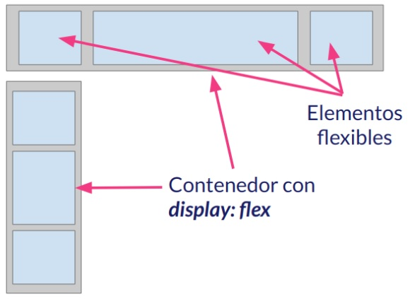

Web de ayuda para contenedores Flex
https://developer.mozilla.org/es/docs/Web/CSS/CSS_Flexible_Box_Layout

### 1.2. Grid
Es un sistema de maquetación más potenten que el anterior ya que podemos trabajar con filas y columnas.


Web de ayuda para contenedores Grid
https://developer.mozilla.org/es/docs/Web/CSS/CSS_Grid_Layout


## 2. Flex

Simplemente añadiendo la propiedad CSS `display:flex`, los elementos ajustarán su ancho a su contenido y flotarán a la izquierda.

Vamos a tener dos componentes:
1. El contenedor FLEX, que es aquel con la propiedad `display:flex` en nuestro CSS.
2. Los elementos flexibles, que están en el contenedor.

### 2.1. Contenedor Flex

Las propiedades que podemos modificar de los elementos flexibles que están dentro de un contenedor flex son:
* La altura 
* La anchura
* El orden
* La alineación vertical
* La alineación horizontal
* La distribución a lo largo del contenedor

#### 2.1.1. Dirección Elementos Flexibles `flex-direction`
* `row`(default): Ajusta los elementos flexibles de izquierda a derecha
* `row-reverse`: Igual que el anterior pero de derecha a izquierda
* `column`: Ajusta los elementos flexibles en columna de arriba a abajo
* `column-reverse`: Igual que el anterior pero de abajo a arriba

*Ejemplo: 01_Flex_Direction.html*

#### 2.1.2. Ajuste Elementos Flexibles (Si no caben) `flex-wrap`
* `nowrap` (default): Todos los elementos en una misma línea aunque no quepan en ella
* `wrap`: El elemento que no cabe pasa a la línea de abajo
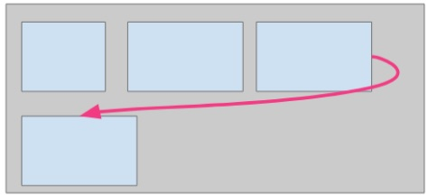

* `wrap-reverse`: El elemento que no cabe pasa a la línea de arriba.
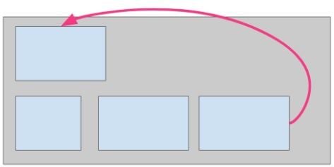

*Ejemplo: 02_Flex_Wrap.html*

#### 2.1.3. Dirección y Ajuste `flex-flow`
Tendríamos en una misma propiedad la Dirección y el ajuste de los elementos. Su formato es:
`flex-flow: flex-direction flex-wrap`

#### 2.1.4. Alineación Horizontal de los Elementos Flexibles `justify-content` 
* `flex-start`: Los elementos flexibles se sitúan al principio
* `flex-end`: Los elementos flexibles se situán al final
* `center`:  Los elementos se centran horizontalmente
* `space-between`: Distribuye el espacio restante entre los elementos pero el primero y el último están en los bordes
* `space-around`: Distribuye el espacio restante entre los elementos pero no tiene en cuenta la distancia a los bordes
* `space-evenly`: Distribuye el espacio restante entre los elementos y tiene en cuenta la distancia a los bordes

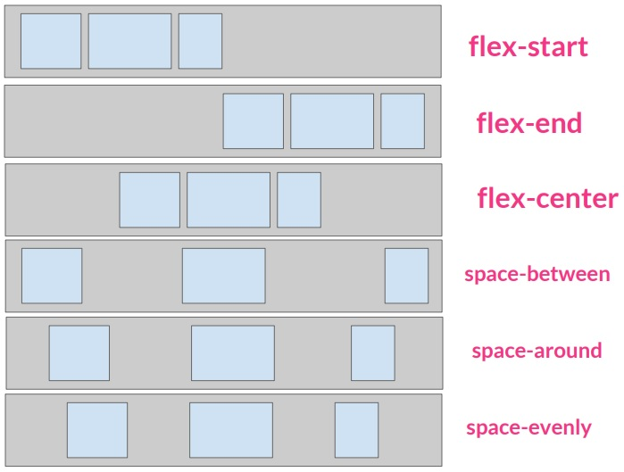

*Ejemplo: 03_Justify_Content.html*

En la página https://flexboxfroggy.com/#es podéis jugar con una rana y probar esta propiedad y las siguientes.

#### 2.1.5. Alineación Vertical de los Elementos Flexibles `align-items` 
* `flex-start`: Ajusta los elemento en la parte superior del contenedor
* `flex-end`: Ajusta los elemento en la parte inferior del contenedor
* `center`:  Ajusta los elemento en el centro del contenedor
* `stretch`(no height): Estira los elementos para que ocupe el contenedor de arriba a abajo
* `baseline`: Los elementos se alinean en relación con la primera línea de texto que posean los elementos flexibles.

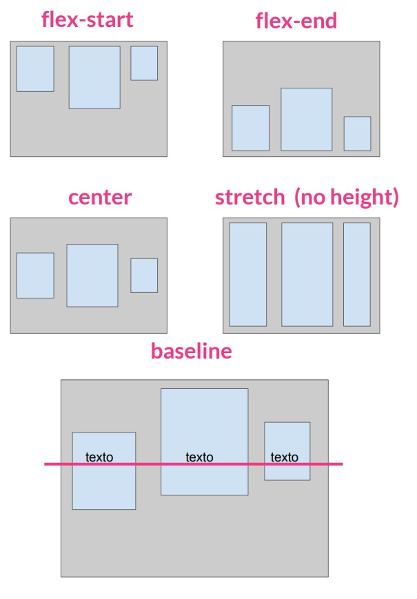

*Ejemplo: 04_Align_Items.html*

#### 2.1.6. Alineación Vertical de los Elementos Flexibles si hay varias líeas (vertical wrap) `align-content` 
Para que funcione esta propiedad tenemos que tener definida la propiedad `flex-wrap` con algún tipo de wrap, ya que por defecto tenemos el valor nowrap.

Con la propiedad `flex-wrap` conseguíamos decir cómo queremos que se comporten nuestros elementos flexibles si no caben en el contenedor, y con esta lo que conseguimos es alinear verticalemente ese desbordamiento.

* `flex-start`: Ajusta los elemento en la parte superior del contenedor y hace wrap hacia abajo. No hace caso a la propiedad `align-items` si está definida.
* `flex-end`: Ajusta los elemento en la parte inferior del contenedor y hace wrap hacia arriba. No hace caso a la propiedad `align-items` si está definida.
* `center`: Ajusta los elemento en el centro del contenedor y centra el wrap.
* `stretch`: Estira los elementos para que ocupen todo el contenedor.
* `space-between`: ajusta el espacio entre los elementos después del wrap pero el primero y el último están en los bordes
* `space-around`: Ajusta el espacio entre los elementos después del wrap pero no tiene en cuenta la distancia a los bordes superior e inferior.

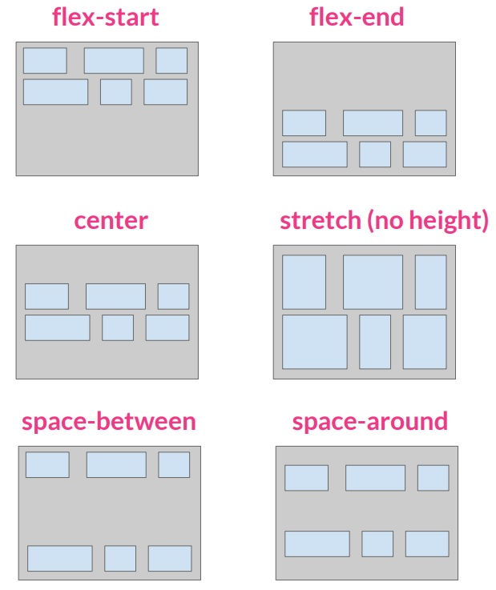

*Ejemplo: 05_Align_Contents.html*


### 2.2. Elementos Flexibles

Las propiedades que vamos a ver ahora son para cambiar los elementos flexibles.

#### 2.2.1. Orden `order`
Sirve para modificar el orden en el que se van a mostrar los elementos flexibles.

`order: 4`(Default 0): El oden en el que se muestran los elementos los hace ordenando el valor de esta propiedad de manera descendente, es decir, muestra primero los números más pequeños. 

Si hay dos elementos que el mismo valor se muestra primero el que primero estuviera definido en el HTML.

Se pueden usar valores negativos.


#### 2.2.2. Tamaño 
* `flex-grow: Valor` (Default: 1):  Es el factor de crecimiento de un elemento flexible cuando se reparten el espacio libre del contenedor.


* `flex-shrink`: Es el factor de contracción de un elemento flexible cuando el tamaño de todos sobrepasa el tamaño del contenedor.

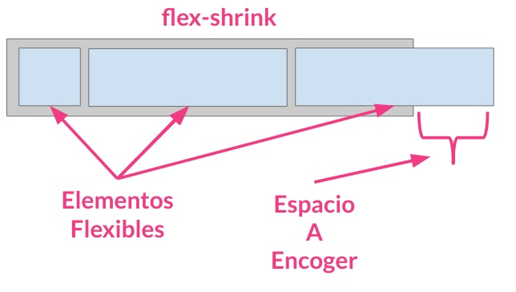

Ese espacio a encoger se repartirá atendiendo al valor que tengan los elementos flexibles en la propiedad `flex-shrink`.

Así si esos valores fueran: 2,2 y 4 el espacio tendría 8 partes y cada uno encogería la cantidad de partes de su valor.


* `flex_basis` (Default: auto): Para indicar el tamaño de un elemento antes de que el espacio restante o excedente se distribuya. En el valor por defecto auto hace que la enchura del elemento flexible se ajuste a su contenido.


*Ejemplo: 06_Order_Tama.html*

Usando la propiedad `flex` podemos definir estas tres propiedades en una sola línea:

```CSS
flex: grow shrink basis;
```

#### 2.2.3. Alineación Vertical elemento concreto
En apartados anteriores hemos visto que desde el contenedor FLEX se puede establecer la alineación vertical de todos los elementos flexibles que contiene. Esto lo hacíamos con la propiedad CSS `align-items`.

En ocasiones puedo necesitar que un elemento flexible tenga una alineación vertical diferente al resto. En este caso, en el elemento para el que quiero una alineación diferente, debo añadir la propiedad CSS `align-self` que puede tomar los mismo valores (y con el mismo significado) que la propiedad `align-items`.

* flex-start
* flex-end
* center
* strecth (no debe tener altura establecida)
* baseline

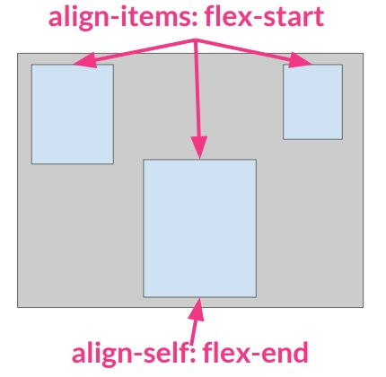

*Ejemplo: 07_Alineacion.html*

<br><hr>

▶️ **A jugar**

Vamos a ver ahora todas las propiedades en acción de forma muy visual a través de este [página](https://codepen.io/enxaneta/full/adLPwv/) donde vamos a poder jugar con todas las propiedades.
<hr>


<mark> 💡 ¿ Y en la práctica algún ejemplo ?</mark>

Aquí teneís una [página](https://philipwalton.github.io/solved-by-flexbox/) web maquetada con FlexBox... 

<div style="position: relative">
<a href="https://philipwalton.github.io/solved-by-flexbox/">
    
    </img>
</a>
</div>

📝 Y un resumen para recordar todas las configuraciones:


<div style="position: relative; overflow-y: none">
<a href="https://d33wubrfki0l68.cloudfront.net/1568560c9e488c136e10bdb4ee7a3f62ec866649/41bbc/content/2014/oct/flexboxsheet.png">

</img>
</a>
</div>

<br><br>

📝 Y un [resumen interactivo](https://yoksel.github.io/flex-cheatsheet/#section-display) muy chulo y sencillo...


 
 
<br><br>

## 3. Grid

Vamos a tener dos componentes:
1. El contenedor GRID, que es aquel definido en nuestro CSS con algunas de estas dos propiedades:
    - `display:grid`: si queremos que nuestra rejilla (nuestro grid) sea un elemento de bloque.
    - `display:inline-grid`: si queremos que nuestro grid sea un elemento en línea.
2. Los elementos grid, que están en el contenedor.

La estructura de un sitio web mediante GRID podría ser algo así:


### 3.1 Contenedor GRID. Propiedades.

Las propiedades que podremos controlar desde el contenedor GRID serán:
* Estructura en filas y columnas y la separación entre ellas.
* Podremos definir las áreas GRID dándoles un nombre.
* La alineación horizontal y vertical del GRID y de los elementos GRID.

#### 3.1.1 Definición de las estructura del GRID. 

La definición de la estructura del GRID es lo primero que debemos hacer cuando queremos maquetar nuestra web con GRID.

Con las propiedades `grid-template-columns` y `grid-template-rows` podemos definir el tamaño y número de columnas y filas de nuestro contenedor GRID, respectivamente.

Las dos propiedades funcionan de la misma manera. 

Veamos un ejemplo con `grid-template-columns`:

```CSS
/*3 columnas en porcentaje*/
grid-template-columns: 20% 50% 30%

/*4 columnas en pixeles y una que tomará el espacio que sobra en el contenedor*/
grid-template-columns: 100px auto 100px 100px

/*4 columnas que se reparten el ancho del contenedor*/
grid-template-columns: auto auto auto auto

/*3 colunas que identificamos con sus nombres poníendolo entre []*/
grid-template-columns : [id] 100px [nombre] 300px [apellidos] auto

/*3 columnas que ocupan el 20% llamadas col-start y una 4 automática*/
grid-template-column: repeat(3, 20% [col-start]) auto

/*4 columnas, la segunda tiene 100px y el espacio restante se divide en partes iguales y se reparten 2 para la 1ª, 1 para la 3ª y 2 para la 4ª*/
grid-template-column: 2fr 100px 1fr 2fr

```
* `grid-row-gap`: Seperación entre las filas.
* `grid-column-gap`: Separación entre las columnas.

*Ejemplo: 08_GRID_Propiedades.html*

#### 3.1.2 Alineación Horizontal (Elementos dentro del GRID) `justify-items`
Con esta propiedad podemos alinear horizontalmente el contenido de cada celda.

* `justify-items: start`: Al principio de la celda.
* `justify-items: end`: Al final.
* `justify-items: center`: Centra el contenido
* `justify-items: stretch` (default): Estira el contenido para ocupar la celda entera.


*Ejemplo: 08_GRID_Propiedades.html*

#### 3.1.3 Alineación Vertical (Elementos dentro del GRID) `align-items`
Con esta propiedad podemos alinear verticalmente el contenido de cada celda.

* `align-items: start`: En la parte de arriba de la celda.
* `align-items: end`: En la parte de abajo.
* `align-items: center`: Centra el contenido
* `align-items: stretch` (default): Estira el contenido para ocupar la celda entera.

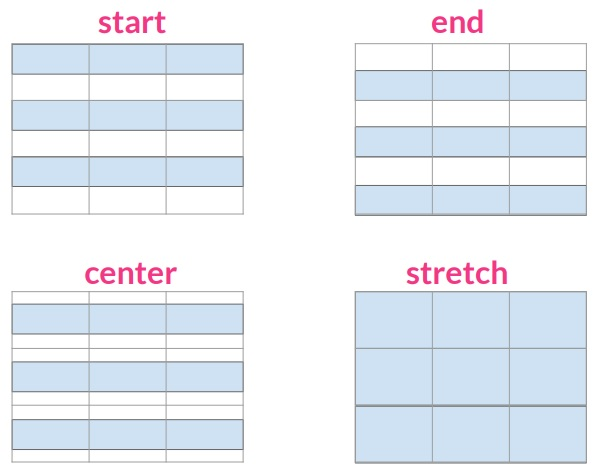

*Ejemplo: 08_GRID_Propiedades.html*

Con la propiedad `place-items` establecemos la alineación horizontal y vertical a la misma vez.

```CSS
place-item: Vertical Horizontal
```

#### 3.1.4 Distribución del GRID dentro del contenedor
Si nuestro GRID no ocupa el contenedor completo podemos alinearlo horizontal `justify-content` y verticalmente `align-content`


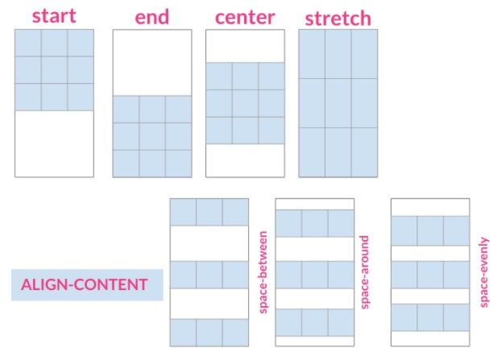

*Ejemplo: 09_GRID_justify_content.html*

Con la propiedad `place-content` podemos definir a la vez las dos propiedades anteriores.

```CSS
place-content: Vertical Horizontal
```

### 3.2 Elementos GRID. Propiedades.

Son los elementos que tenemos dentro de nuestro contenedor GRID.

Las propiedades que podremos controlar de los elementos del GRID serán:

* Área del GRID que va a ocupar.
* Alineación horizontal de manera individual.
* Alineación vertical de manera individual.
* Colocación implícita si no especificamos nada.

#### 3.2.1 Area a ocupar por el Elemento GRID
Especificamos el area del Grid que va a ocupar cada elemento. Esto lo vamos a poder hacer 4 propiedades:

* `grid-column-start`: Columna de comienzo del area.
* `grid-column-end`: Columna de finalización del area.
* `grid-row-start`: Fila de comienzo del area.
* `grid-row-end`: Fila de finalización del area.

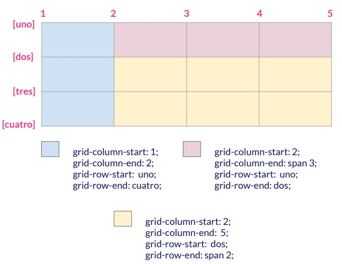

Normalmente se usan las siguientes propiedades con las que definimos el inicio y fin de las columnas y las filas:
* `grid-column: Inicio / Fin`: Inicio y fin de las columnas.
* `grid-row: Inicio / Fin`: Inicio y fin de las filas.
* `grid: Fila_Inicio Col_Inicio Fila_Fin Col_Fin`: Inicio y fin del area completa.

En la página https://cssgridgarden.com/#es podéis jugar con una rana y probar esta propiedad y las siguientes.

#### 3.2.2 Alineación Horizontal del Elemento GRID `justify-self`
Esta propiedad sirve para darle a un elemento GRID una alineación horizontal distinta al definido en el GRID con la propiedad `justify-items`.

* `justify-self: start`: Al principio de la celda.
* `justify-self: end`: Al final.
* `justify-self: center`: Centra el contenido
* `justify-self: stretch` (default): Estira el contenido para ocupar la celda entera.

#### 3.2.3 Alineación Vertical del Elemento GRID `align-self`
Esta propiedad sirve para darle a un elemento GRID una alineación vertical distinta al definido en el GRID con la propiedad `align-items`.

* `align-self: start`: En la parte de arriba de la celda.
* `align-self: end`: En la parte de abajo.
* `align-self: center`: Centra el contenido
* `align-self: stretch` (default): Estira el contenido para ocupar la celda entera.

#### 3.2.4 Colocación Implícita del Elemento GRID
Esto ocurre cuando colocamos elementos GRID fuera de la estructura del contenedor GRID o cuando no le damos una posición.

Las propiedades, que se definen en el CONTENEDOR GRID, que nos van a permitir definir la colocación implicita son:

* `grid-auto-columns`: Dará tamaño a las columnas de separación entre los límites del contenedor y la posición donde hemos dejado nuestro elemento.
* `grid-auto-rows`: Dará tamaño a las filas de separación entre los límites del contenedor y la posición donde hemos dejado nuestro elemento.

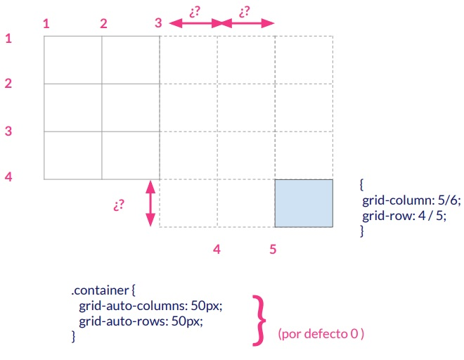

* `grid-auto-flow`: Para cuando tenemos elementos GRID sin una posición definida. Puede tener los siguientes valores:
    * `row`(Default): Rellena primero las filas.
    * `column`: Rellena primero las columnas.
    * `dense`: Intenta rellenar primero los huecos por si viene elementos posteriores más pequeño. Hay que tener cuidado al usar ésta porque puede provocar cambios de orden en los elementos.

*Ejemplo: 10_GRID_elementos.html*


### 3.3 AREAS GRID.

Si no queremos especificar el tamaño para cada zona del GRID podemos darles nombre a su propiedad `grid-area` y usar esos nombres en la propiedad `grid-template-area`.

Sería algo parecido a hacer un plano de nuestro GRID.

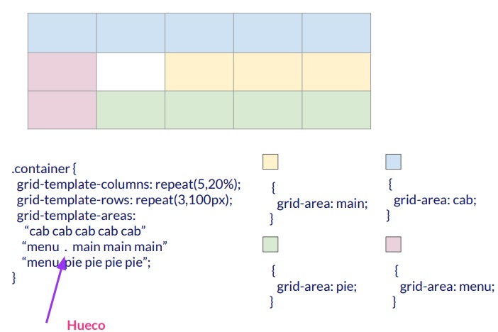

*Ejemplo: 11_GRID_AREA.html*

## 4. ¿FLEX o GRID?

Tanto GRID como FLEX nos facilitan mucho las cosas a la hora de maquetar nuestras páginas web a como se hacía antes de HTML5. 

Es mucho más sencillo que usar los sistemas que había tradicionalmente en lo que todo giraba en torno a tablas, float, position,...

### 4.1 Ventajas de Usar FLEX
* Sólo tenemos que controlar una dirección, ya sea horizontal o vertical.
* Es mucho más sencillo controlar la alineación de los elementos flexibles.

### 4.2 Desventajas de Usar FLEX
* Para el mismo layout creado con GRID, hacerlo sólo con FLEX es mucho más complejo y necesitare una estructura HTML mucho más compleja.

### 4.3 Ventajas de Usar GRID
* En una única estructura tenemos el control de la dos dimensiones.
* Es muy sencillo definir la estructura general de nuestra web gracias a `grid-template-row` y `grid-template-column`.
* Es muy sencillo definir la separación entre filas y columnas gracias a `grid-row-gap` y `grid-column-gap`

### 4.4 Desventajas de Usar GRID
* Es complicada conseguir la alineación de los elementos que están dentro de las celdas.

<br><br>

### 4.5 Conclusiones
Tenemos que tener en cuenta tanto FLEX como GRID a la hora de realizar la maquetación de nuestras web.

Habrá cosas que solo podremos hacer o será más fácil de hacer de una u otra manera y otras cosas que podremos conseguir combinando las dos.

<br><hr>

▶️ **A jugar**

Vamos a ver ahora todas las propiedades en acción de forma muy visual a través de este [página](https://alialaa.github.io/css-grid-cheat-sheet/) donde vamos a poder jugar con todas las propiedades.
<hr>


<mark> 💡 ¿ Y en la práctica algún ejemplo ?</mark>

Aquí teneís una [página](https://grid-masterclass.webflow.io/) web maquetada con CSS-Grid... 

<div style="position: relative">
 <a href="https://curicullum.webflow.io/">
    
    </img>
</a>
</div>

y otra ...

<div style="position: relative">
 <a href="https://grid-masterclass.webflow.io/">
    
</a>
</img>
</div>

<br><br>

📝 Y un [resumen interactivo](https://grid.malven.co/) muy chulo y sencillo...

<div style="position: relative">
 <a href="https://grid.malven.co/">
    
</a>
</img>
</div>


<br>
<hr>
<br>

### APRENDER JUGANDO

Flexbox y CSS-Grid son técnicas muy poderosas que al principio parecen muy intimidantes y difíciles de aprender.<br>
Aquí teneis una serie de juegos que os facilitarán el aprendizaje:

Aprender FlexBox

1. [FlexBox Froggy](https://flexboxfroggy.com/#es) (aprender jugando con las ranas)
2. [FlexBox defense](http://www.flexboxdefense.com/) defiendete con FlexBox.
3. [Flex Box Aventuras](https://codingfantasy.com/games/flexboxadventure/play) rescata a la princesa con tus habilidades y flexbox.
   
Aprender CSS-Grid

1. [Grud Garden](https://cssgridgarden.com/#es) riega el jardin y aprende
2. [Grid-attack](https://codingfantasy.com/games/css-grid-attack defiendete de los monstruos con CSS-Grid)
3. 

<br><br>

¿Donde continuar ahora?


[Maquetación y Diseño Responsivo con Flexbox y CSS Grid](CSS-Grid_FlexBox.md)
