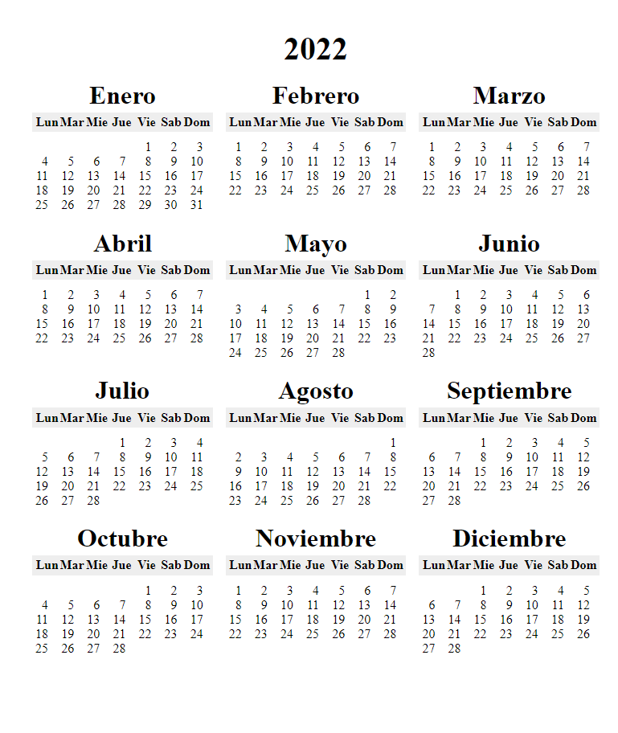
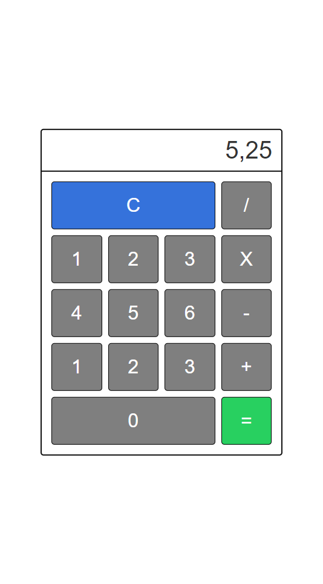

# BOLETÍN 8. EJERCICIOS/DESAFIOS MAQUETACIÓN con FLEXBOX y CSS-Grid

En este boletín vamos a trabajar la maquetación, trabajando con ejercicios a modo de desafio que se deben resolver aplicando Flexbox y/o CSS-Grid.
    
    ✔️ Obtener recursos

    Para facilitar el obtener los recursos (imagenes, etc..) y no tener que descargarlas una a una, lo mejor es que os cloneis este repositorio completo.
    Si ya lo habéis hecho, simplemente obtener los cambios y ya tendréis actualizado el repositorio del curso en vuestro ordenador.

    Notas 💡
    
    Para la entrega será necesario crear un carpeta 'b8' dentro de la carpeta 'Bloque2'.

    Para cada ejercicio hay que crear una sub-carpeta XX.Ejercicio (03.Ejercicio), y dentro los elementos (html).
    - Para los ficheros CSS se creará una carpeta 'css' y se colocarán los ficheros CSS necesarios. El fichero CSS lo llamaremos 'style.css'.
    - Si hubiera imágenes se creará una carpeta "img".
    
    Para muchos ejercicios se da un código HTML y/o CSS de base, que tendréis que copiar en los ficheros 'index.html' y/o 'style.css'. Recordar vincular el CSS al HTML.

    Todos los ejercicios será requeridos subirlos al repositorio Github privado de cada uno.

    Además, será necesario entregar el documento del boletín, incluyendo el enlace a la ruta raiz del boletín en vuestro respositorio de Github.

    ⚡Importante

    No se podrá modificar la carpeta 'b8' ni ninguno de los ejercicios realizados con fecha posterior a la fecha máxima de entrega del boletín.
    Si lo habéis entregado, y quereis modificarlo de nuevo, los podéis hacer hasta la fecha máxima de entrega.
    
 

## Ejercicio 1. CALENDARIO 2022

En este ejercicio se debe maquetar el calendario completo de 2022. 

`Tareas a realizar`:

1. Tener un título (2022)
2. Distribución del calendario sera:
   * Ancho mínimo de cada mes: 200px.
   * Filas: Las que se requieran

3. Cada mes tendrá un título con el nombre del mes.
4. También habrá una fila para los nombres de los días.
5. El 1er día del mes debe empezar en el día de la semana correcto.

6. E**l calendario debe ser responsivo**, es decir, que se tiene que adaptar al dispositivo/pantalla/ancho disponible.
   1. Cada mes tendrá un ancho mínimo que permita su visualización correcta.
   2. Se debe aplicar la técnica Drop-column, es decir, que las columnas/meses deben pasar a la siguiente fila si con el espacio disponible no hay espacio para 3 meses de ancho.

  

El calendario se debe ver algo así, en un ancho de 800px +/-.

 

En modo responsivo quedaría:

  

## Ejercicio 2. CALCULADORA BÁSICA MODELO-1

 

En este ejercicio la idea es maquetar una calculadora con CSS-Grid y/o FlexBox.

Diseñar una calculadora (diseño) como aparece en la imagen.

`Tareas a realizar`:

1. Tiene que tener un control/etiqueta html `<input>` para que el usuario puede introducir *solo* números.
2. Debe incluir todos los botones que se muestran en la imagen, y con el tamaño, color y las posiciones iguales.
3. La calculadora debe estar centrada tanto Vertical como Horizontalmente, apareciendo en el centro de la pantalla/viewport.

  

Imagen de ejemplo:

